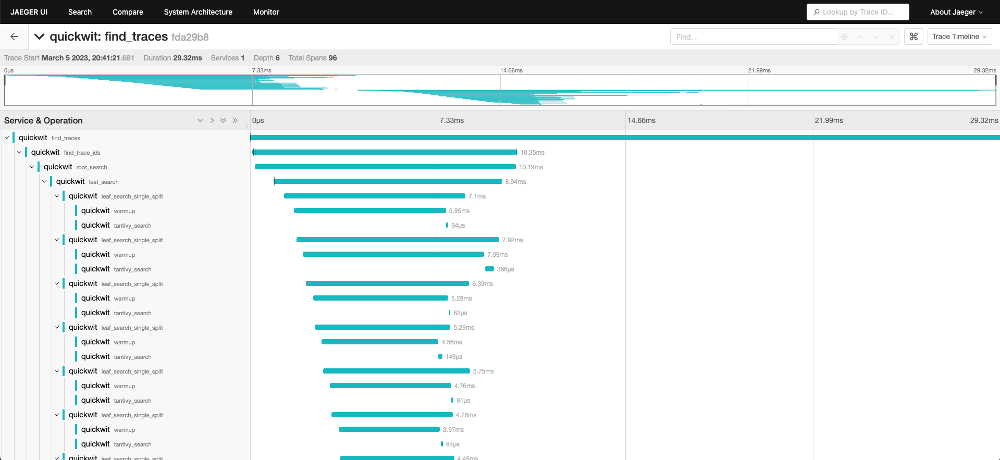

In this tutorial, we will show you how Quickwit can eat its own dog food: we will send Quickwit traces into Jaeger and analyze them, which will generate new traces to analyze :)

## Start Quickwit

First, start a [Quickwit instance](../get-started/installation.md) with the OTLP service enabled:

```bash
QW_ENABLE_OPENTELEMETRY_OTLP_EXPORTER=true \
OTEL_EXPORTER_OTLP_ENDPOINT=http://127.0.0.1:7281 \
./quickwit run
```

We also set `QW_ENABLE_OPENTELEMETRY_OTLP_EXPORTER` and `OTEL_EXPORTER_OTLP_ENDPOINT` environment variables so that Quickwit will send its own traces to itself.

## Start Jaeger UI

Let's start a Jaeger UI instance with docker. Here we need to inform jaeger that it should use quickwit as its backend.

Due to some idiosyncrasy associated with networking with containers, we will have to use a different approach on MacOS & Windows on one side, and Linux on the other side.

### MacOS & Windows

We can rely on `host.docker.internal` to get the docker bridge ip address, pointing to our quickwit server.

```bash
docker run --rm --name jaeger-qw \
    -e SPAN_STORAGE_TYPE=grpc \
    -e GRPC_STORAGE_SERVER=host.docker.internal:7281 \
    -p 16686:16686 \
    jaegertracing/jaeger-query:1.60
```

### Linux

By default, Quickwit is listening to `127.0.0.1`, and will not respond to request directed
to the docker bridge (`172.17.0.1`). There are different ways to solve this problem.
The easiest is probably to use host network mode.

```bash
docker run --rm --name jaeger-qw  --network=host \
    -e SPAN_STORAGE_TYPE=grpc \
    -e GRPC_STORAGE_SERVER=127.0.0.1:7281 \
    -p 16686:16686 \
    jaegertracing/jaeger-query:1.60

```

## Search traces in Jaeger UI

As Quickwit is indexing its own traces, you should be able to see them in Jaeger UI after 5 seconds (the time it takes for Quickwit to do its first commit).

Open the Jaeger UI at [http://localhost:16686](http://localhost:16686) and search for traces! By executing search queries, you will then see Quickwit's own traces:

- `find_traces` is the endpoint called when you search for traces in Jaeger UI, it then calls `find_trace_ids`.
- `find_traces_ids` is doing an aggregation query on spans to get unique trace IDs.
- `root_search` is Quickwit search entry point. It calls search on each split (piece of index) in parallel, in a distributed manner, or just locally if there is only one node.
- `leaf_search` is the search entry point on each node. It calls `leaf_search_single_split` on each split.
- `leaf_search_single_split` is the search entry point on a split. It will call consecutively `warmup` and `tantivy_search`.
- `warmup` is the warmup phase of the search. It prefetches data needed to execute the search query.
- `tantivy_search` is the search phase of the search. It is executing the search query at horse speeds with the [Tantivy](https://github.com/quickwit-oss/tantivy).



## Next steps

You are now ready for the next step: instrumenting your application and sending its traces to Quickwit. You can do it:
- In [python](send-traces/using-otel-sdk-python.md).
- And in any other language that OpenTelemetry supports.
