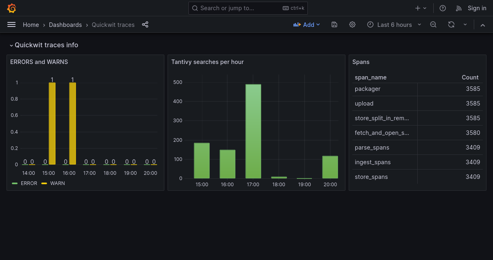

In this tutorial, we will set up a Grafana Dashboard showing Quickwit traces using Docker Compose.

You only need a few minutes to get Grafana working with Quickwit and build meaningful dashboards.

## Create a Docker Compose recipe

First, create a `docker-compose.yml` file. This file will define the services needed to run Quickwit with OpenTelemetry and Grafana with the Quickwit Datasource plugin.

Below is the complete Docker Compose configuration:

```yaml
version: '3.0'
services:
  quickwit:
    image: quickwit/quickwit
    environment:
      QW_ENABLE_OPENTELEMETRY_OTLP_EXPORTER: "true"
      OTEL_EXPORTER_OTLP_ENDPOINT: "http://localhost:7281"
    ports:
      - 7280:7280
    command: ["run"]

  grafana:
    image: grafana/grafana-oss
    container_name: grafana
    ports:
      - "${MAP_HOST_GRAFANA:-127.0.0.1}:3000:3000"
    environment:
      GF_INSTALL_PLUGINS: https://github.com/quickwit-oss/quickwit-datasource/releases/download/v0.4.6/quickwit-quickwit-datasource-0.4.6.zip;quickwit-quickwit-datasource
      GF_AUTH_DISABLE_LOGIN_FORM: "true"
      GF_AUTH_ANONYMOUS_ENABLED: "true"
      GF_AUTH_ANONYMOUS_ORG_ROLE: Admin
```

The default Grafana port is 3000. If this port is already taken, you can modify the port mapping, for example, changing 3000:3000 to 3100:3000 or any other available port.

Save and run the recipe:

```bash
$ docker compose up
```

You should be able to access Quickwit's UI on `http://localhost:7280/` and Grafana's UI on `http://localhost:3000/`.

## Setting up the datasource

In Grafana, head to [Data Sources](http://localhost:3000/connections/datasources). If the plugin is installed correctly you should be able to find Quickwit in the list.

We're going to set up a new Quickwit data source looking at Quickwit's own OpenTelemetry traces, let's configure the datasource with the following parameters:

- URL : `http://quickwit:7280/api/v1` _This uses the docker service name as the host_
- Index ID : `otel-traces-v0_7`

Save and test, you should obtain a confirmation that the datasource is correctly set up.


You can also set up a new Quickwit data source looking at Quickwit's own OpenTelemetry logs (or your own logs index), let's configure the datasource with the following parameters:

- URL : `http://quickwit:7280/api/v1` _This uses the docker service name as the host_
- Index ID : `otel-logs-v0_7`


## Creating a dashboard

You can then [create a new dashboard](http://localhost:3000/dashboard/new) and add a visualization : you should be able to choose the traces quickwit datasource here.

Quickwit sends itself its own traces, so you should already have data to display. Let's configure some panels !

- a Table counting span_names 
  - **Panel type** : Table
  - **Query**: _empty_
  - **Metric** : Count
  - **Group by** : Terms : `span_name` : order by Count
- a Bar Chart showing the amount of tantivy searches per hour :
  - **Panel type**: Time Series
  - **Query** : "span_name:tantivy_search"
  - **Metric**: Count
  - **Group by** : Date Histogram : `span_start_timestamp_nanos` : Interval 1h
- a Bar Chart showing the amount of ERROR logs per hour for the last 6 hours :
  - **Panel type**: Bar Chart
  - **Query**: "service_name:quickwit AND events.event_attributes.level:ERROR"
  - **Metric**: Count
  - **Group by** : Terms : `span_start_timestamp_nanos` : Interval 1h
- another query on the same Bar Chart for WARN logs

## The result

Here's what your first dashboard can look like :




