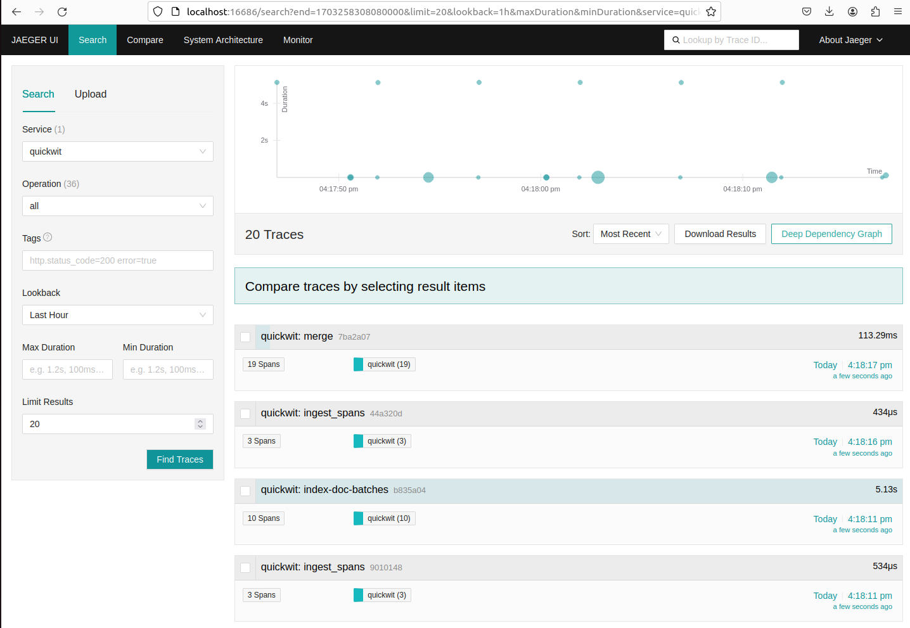

In this quick start guide, we will set up a Quickwit instance and analyze its own traces with Jaeger using Docker Compose.

You only need a minute to get Jaeger working with Quickwit storage backend.


## Start Quickwit and Jaeger

Let's use `docker compose` with the following configuration:

```yaml title="docker-compose.yaml"
version: "3"

services:
  quickwit:
    image: quickwit/quickwit:${QW_VERSION:-0.6.5}
    volumes:
      - ./qwdata:/quickwit/qwdata
    ports:
      - 7280:7280
    environment:
      - QW_ENABLE_OPENTELEMETRY_OTLP_EXPORTER=true
      - OTEL_EXPORTER_OTLP_ENDPOINT=http://localhost:7281
    command: ["run"]

  jaeger-query:
    image: jaegertracing/jaeger-query:1.52
    ports:
      - 16686:16686
    environment:
      - SPAN_STORAGE_TYPE=grpc-plugin
      - GRPC_STORAGE_SERVER=quickwit:7281
      - GRPC_STORAGE_TLS=false
```

As you can see in the docker compose file, Quickwit is configured to send its own traces `OTEL_EXPORTER_OTLP_ENDPOINT` to itself `http://localhost:7281`.
On the other side, Jaeger is configured to use a gRPC storage server `quickwit:7281`.

Save and run the recipe:

```bash
$ docker compose up
```

You should be able to access Quickwit's UI on `http://localhost:7280/` and Jager's UI on `http://localhost:16686/`.


## Searching traces and view one.

Quickwit generates many traces, let's take a few ones:
- `find_traces`: generated by the "Find traces" Jaeger button.
- `get_operations`: generated by Jaeger when it is fetching the list of operations.
- `get_services`: generated by Jaeger when it is fetching the list of services.
- `ingest-spans`: generated when Quickwit receives spans on the gRPC OTLP API.
- ...

Here are the screenshots of the search and trace view:




## Next tutorials

- [Send traces using an OTEL collector](/docs/distributed-tracing/send-traces/using-otel-collector.md)
- [Send traces from a python web server](/docs/distributed-tracing/send-traces/using-otel-sdk-python.md)
