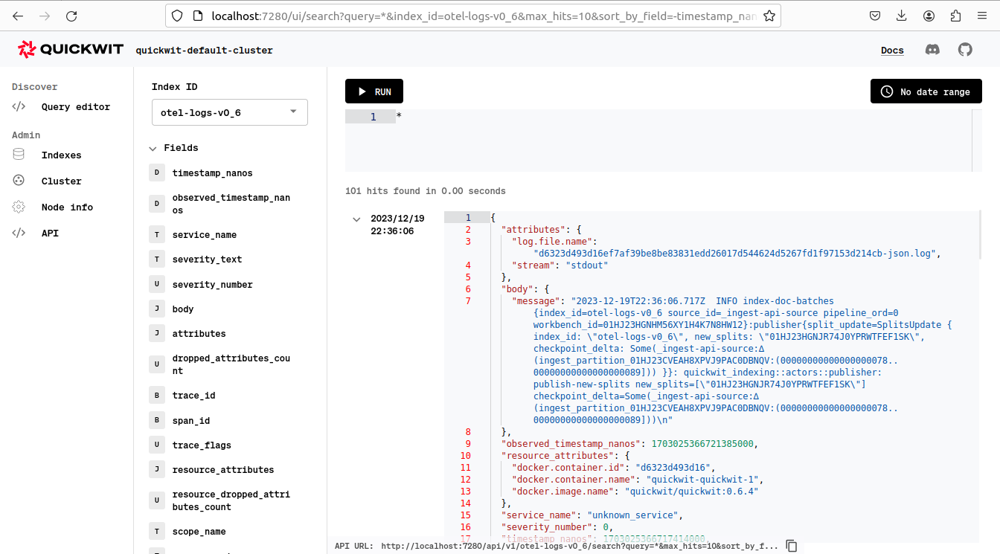

To send docker container logs into Quickwit, you just need to setup an OpenTelemetry Collector with the file logs receiver. In this tutorial, we will use `docker compose` to start the collector and Quickwit.

You only need a minute to get your Quickwit log UI!



## OTEL collector configuration

The following collector configuration will collect docker logs in `/var/lib/docker/containers/*/*-json.log` (depending on your system, log files can be at a different location), add a few attributes and send them to Quickwit through gRPC at `http://quickwit:7281`.


```yaml title="otel-collector-config.yaml"
receivers:
  filelog:
    include:
      - /var/lib/docker/containers/*/*-json.log
    operators:
     - id: parser-docker
       timestamp:
         layout: '%Y-%m-%dT%H:%M:%S.%LZ'
         parse_from: attributes.time
       type: json_parser
     - field: attributes.time
       type: remove
     - id: extract_metadata_from_docker_tag
       parse_from: attributes.attrs.tag
       regex: ^(?P<name>[^\|]+)\|(?P<image_name>[^\|]+)\|(?P<id>[^$]+)$
       type: regex_parser
       if: 'attributes?.attrs?.tag != nil'
     - from: attributes.name
       to: resource["docker.container.name"]
       type: move
       if: 'attributes?.name != nil'
     - from: attributes.image_name
       to: resource["docker.image.name"]
       type: move
       if: 'attributes?.image_name != nil'
     - from: attributes.id
       to: resource["docker.container.id"]
       type: move
       if: 'attributes?.id != nil'
     - from: attributes.log
       to: body
       type: move

processors:
  batch:
    timeout: 5s

exporters:
  otlp/qw:
    endpoint: quickwit:7281
    tls:
      insecure: true

service:
  pipelines:
    logs:
      receivers: [filelog]
      processors: [batch]
      exporters: [otlp/qw]
```

## Start the OTEL collector and a Quickwit instance

Let's use `docker compose` with the following configuration:

```yaml title="docker-compose.yaml"
version: "3"

x-default-logging: &logging
 driver: "json-file"
 options:
   max-size: "5m"
   max-file: "2"
   tag: "{{.Name}}|{{.ImageName}}|{{.ID}}"

services:
  quickwit:
    image: quickwit/quickwit:${QW_VERSION:-0.8.1}
    volumes:
      - ./qwdata:/quickwit/qwdata
    ports:
      - 7280:7280
    environment:
      - NO_COLOR=true
    command: ["run"]
    logging: *logging

  otel-collector:
    user: "0" # Needed to access the directory /var/lib/docker/containers/
    image: otel/opentelemetry-collector-contrib:${OTEL_VERSION:-0.87.0}
    volumes:
      - ./otel-collector-config.yaml:/etc/otel-collector-config.yaml
      - /var/lib/docker/containers:/var/lib/docker/containers:ro
    command: ["--config=/etc/otel-collector-config.yaml"] 
    logging: *logging
```


You will notice the custom `logging`, the OTEL collector will use that additional information to enrich the logs.

## Run it and search

Download the configuration files and start the containers:
   
```bash

mkdir qwdata
docker compose up
```

After a few seconds, you will see the logs in the Quickwit UI [http://localhost:7280](http://localhost:7280).


Here is what it should look like:

```json
{
  "attributes": {
    "log.file.name": "34ad1a84c71de1d29ad75f99b56d01205e2976440f2398734037151ba2bcde1a-json.log",
    "stream": "stdout"
  },
  "body": {
    "message": "2023-10-23T16:39:57.892  INFO --- [   asgi_gw_1] localstack.request.aws     : AWS s3.ListObjects => 200\n"
  },
  "observed_timestamp_nanos": 1698079197979435000,
  "service_name": "unknown_service",
  "severity_number": 0,
  "timestamp_nanos": 1698079197892726000,
  "trace_flags": 0
}
```


## Troubleshooting

It's possible that you get no logs in the UI. In this case, check the `docker compose` logs. The problem can typically come from a wrong configuration of the OTEL collector.
