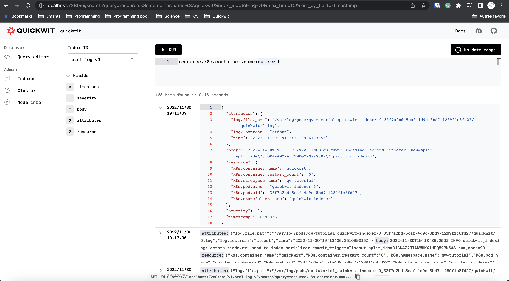

This guide will help you to unlock log search on your k8s cluster logs. We will first deploy Quickwit and OTEL collectors with [Helm](https://helm.sh/) and then see how to index and search them.

:::warning

This tutorial uses Quickwit [Ingest API](/docs/reference/rest-api#ingest-data-into-an-index) which is not yet production ready and the OTEL logs index that is currently experimental.

:::

## Prerequisites

You will need the following to complete this tutorial:
- A Kubernetes cluster.
- The command line tool [kubectl](https://kubernetes.io/docs/reference/kubectl/).
- The command line tool [Helm](https://helm.sh/).
- An access to an object storage like AWS S3, GCS, Azure blob storage, Scaleway, to store index data.


## Install with Helm

Let's first create a namespace to isolate our experiment and set it as the default namespace.

```bash
kubectl create namespace qw-tutorial
kubectl config set-context --current --namespace=qw-tutorial
```


Then let's add [Quickwit](https://github.com/quickwit-oss/helm-charts) and [Otel](https://github.com/open-telemetry/opentelemetry-helm-charts) helm repositories:

```bash
helm repo add quickwit https://helm.quickwit.io
helm repo add open-telemetry https://open-telemetry.github.io/opentelemetry-helm-charts
```

You should now see the two repos in helm:

```bash
helm repo list
NAME                	URL
quickwit            	https://helm.quickwit.io
open-telemetry      	https://open-telemetry.github.io/opentelemetry-helm-charts
```


### Deploy Quickwit

Let's create a basic chart configuration:

```bash
export AWS_REGION=us-east-1
export AWS_ACCESS_KEY_ID=XXXX
export AWS_SECRET_ACCESS_KEY=XXXX
export DEFAULT_INDEX_ROOT_URI=s3://your-bucket/indexes
```

```bash
# Create Quickwit config file.
echo "
searcher:
  replicaCount: 1
indexer:
  replicaCount: 1
metastore:
  replicaCount: 1
janitor:
  enabled: true
control_plane:
  enabled: true

environment:
  # Remove ANSI colors.
  NO_COLOR: 1

# Quickwit configuration
config:
  # No metastore configuration.
  # By default, metadata is stored on the local disk of the metastore instance.
  # Everything will be lost after a metastore restart.
  s3:
    region: ${AWS_REGION}
    access_key: ${AWS_ACCESS_KEY_ID}
    secret_key: ${AWS_SECRET_ACCESS_KEY}
  default_index_root_uri: ${DEFAULT_INDEX_ROOT_URI}

  # Indexer settings
  indexer:
    # By activating the OTEL service, Quickwit will be able
    # to receive gRPC requests from OTEL collectors.
    enable_otlp_endpoint: true
" > qw-tutorial-values.yaml
```

Before installing Quickwit chart, make sure you have access to S3 and that you did not make a typo in the `default_index_root_uri`. This can be easily done with `aws` CLI with a simple `ls`:

```bash
aws s3 ls ${DEFAULT_INDEX_ROOT_URI}
```

If the CLI did not return an error, you are ready to install the chart:

```bash
helm install quickwit quickwit/quickwit -f qw-tutorial-values.yaml
```

In a few moments, you will see the pods running Quickwit services:

```bash
kubectl get pods
NAME                                      READY   STATUS    RESTARTS      AGE
quickwit-control-plane-7fc495f4c4-slqv4   1/1     Running   2 (84s ago)   87s
quickwit-indexer-0                        1/1     Running   2 (84s ago)   87s
quickwit-janitor-7f75f4bc8-jrfv6          1/1     Running   2 (84s ago)   87s
quickwit-metastore-6989978fc-9s82j        1/1     Running   2 (85s ago)   87s
quickwit-searcher-0                       1/1     Running   2 (84s ago)   87s
```

Let's check Quickwit is working:

```bash
kubectl port-forward svc/quickwit-searcher 7280
```

Then open your browser `http://localhost:7280/ui/indexes`. You should see the list of indexes. If everything is fine, keep the kubectl command running and open a new terminal.

### Deploy OTEL collectors

We need to configure a bit the collectors in order to:
- collect logs from k8s
- enrich the logs with k8s attributes
- export the logs to Quickwit indexer.

```bash
echo "
mode: daemonset
presets:
  logsCollection:
    enabled: true
  kubernetesAttributes:
    enabled: true
config:
  exporters:
    otlp:
      endpoint: quickwit-indexer.qw-tutorial.svc.cluster.local:7281
      # Quickwit OTEL gRPC endpoint does not support compression yet.
      compression: none
      tls:
        insecure: true
  service:
    pipelines:
      logs:
        exporters:
          - otlp
" > otel-values.yaml
```

```
helm install otel-collector open-telemetry/opentelemetry-collector -f otel-values.yaml
```

After a few seconds, you should see logs on your indexer that show indexing has started. It looks like this:
```
2022-11-30T18:27:37.628Z  INFO spawn_merge_pipeline{index=otel-log-v0 gen=0}: quickwit_indexing::actors::merge_pipeline: Spawning merge pipeline. index_id=otel-log-v0 source_id=_ingest-api-source pipeline_ord=0 root_dir=/quickwit/qwdata/indexing/otel-log-v0/_ingest-api-source merge_policy=StableLogMergePolicy { config: StableLogMergePolicyConfig { min_level_num_docs: 100000, merge_factor: 10, max_merge_factor: 12, maturation_period: 172800s }, split_num_docs_target: 10000000 }
2022-11-30T18:27:37.628Z  INFO quickwit_serve::grpc: Starting gRPC server. enabled_grpc_services={"otlp-log", "otlp-trace"} grpc_listen_addr=0.0.0.0:7281
2022-11-30T18:27:37.628Z  INFO quickwit_serve::rest: Starting REST server. rest_listen_addr=0.0.0.0:7280
2022-11-30T18:27:37.628Z  INFO quickwit_serve::rest: Searcher ready to accept requests at http://0.0.0.0:7280/
2022-11-30T18:27:42.654Z  INFO quickwit_indexing::actors::indexer: new-split split_id="01GK4WPTXK8GH3AGTRNBN9A8YG" partition_id=0
2022-11-30T18:27:52.643Z  INFO quickwit_indexing::actors::indexer: send-to-index-serializer commit_trigger=Timeout split_ids=01GK4WPTXK8GH3AGTRNBN9A8YG num_docs=22
2022-11-30T18:27:52.652Z  INFO index_batch{index_id=otel-log-v0 source_id=_ingest-api-source pipeline_ord=0}:packager: quickwit_indexing::actors::packager: start-packaging-splits split_ids=["01GK4WPTXK8GH3AGTRNBN9A8YG"]
2022-11-30T18:27:52.652Z  INFO index_batch{index_id=otel-log-v0 source_id=_ingest-api-source pipeline_ord=0}:packager: quickwit_indexing::actors::packager: create-packaged-split split_id="01GK4WPTXK8GH3AGTRNBN9A8YG"
2022-11-30T18:27:52.653Z  INFO index_batch{index_id=otel-log-v0 source_id=_ingest-api-source pipeline_ord=0}:uploader: quickwit_indexing::actors::uploader: start-stage-and-store-splits split_ids=["01GK4WPTXK8GH3AGTRNBN9A8YG"]
2022-11-30T18:27:52.733Z  INFO index_batch{index_id=otel-log-v0 source_id=_ingest-api-source pipeline_ord=0}:uploader:stage_and_upload{split=01GK4WPTXK8GH3AGTRNBN9A8YG}:store_split: quickwit_indexing::split_store::indexing_split_store: store-split-remote-success split_size_in_megabytes=0.018351 num_docs=22 elapsed_secs=0.07654519 throughput_mb_s=0.23974074 is_mature=false
```

If you see some errors there, it's probably coming from a misconfiguration of your object storage. If you need some help, please open an issue on [GitHub](https://github.com/quickwit-oss/quickwit) or come on our [discord server](https://discord.gg/MT27AG5EVE).  


### Ready to search logs

You are now ready to search, wait 30 seconds and you will see the first indexed logs: just [open the UI](http://localhost:7280/ui/search?query=*&index_id=otel-logs-v0&max_hits=10&sort_by_field=-timestamp_secs) and play with it. Funny thing you will see quickwit logs in it :).

Example of queries:

- [body.message:quickwit](http://localhost:7280/ui/search?query=body.message:quickwit&index_id=otel-logs-v0&max_hits=10&sort_by_field=-timestamp_secs)
- [resource_attributes.k8s.container.name:quickwit](http://localhost:7280/ui/search?query=resource_attributes.k8s.container.name%3Aquickwit&index_id=otel-logs-v0&max_hits=10&sort_by_field=-timestamp_secs)
- [resource_attributes.k8s.container.restart_count:1](http://localhost:7280/ui/search?query=resource_attributes.k8s.container.restart_count%3A1&index_id=otel-logs-v0&max_hits=10&sort_by_field=-timestamp_secs)

 


And that's all folks!

### Clean up

Let's first delete the index and then uninstall the charts.

```bash
# Delete the index. The command will return the list of delete split files.
curl -XDELETE http://127.0.0.1:7280/api/v1/indexes/otel-logs-v0

# Uninstall charts
helm uninstall otel-collector
helm uninstall quickwit

# Delete namespace
kubectl delete namespace qw-tutorial
```
